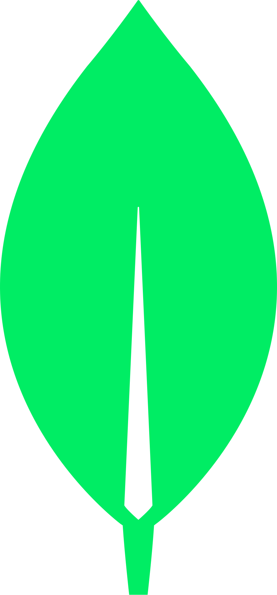

  

## Hi everyone, I'm Lucas Andrade! 👋

-   👨🏻‍💻 **Computer Science Student [6/8]** - [_PUC Minas_](https://computacao.pucpcaldas.br/)
    -   🛡️ **Researcher in Cyber-Intelligence at _CyberOne - Laboratory of Cybernetic Security and Computer Forensics_**
        -   _Focusing on the Construction of Tools and Mechanisms for Locating Digital Evidence of Cybercrimes on the Deep Web and Dark Web_
-   📊 Data Engineer at [_4Data Driven_](http://www.4datadriven.com.br/)
-   ⏳ 23yr old
-    Born in Brazil
-   🖱️ [_Graphic Designer_](https://www.behance.net/lucasomarandradeleal) as hobbie

## Technologies 💻

  
  
  
  
  
  
  
  
  
  
  
  
  

## Forensic 🛡️

 
  
  
  
  
  

## Some Projects 🧑‍💻

-    **C**: [_C Projects_](https://github.com/lucasoal/Faculdade#c) • [_Parking Control_](https://github.com/lucasoal/Faculdade/tree/main/C/C-Estacionamentos) _Honorable mention for the first college project_
-    **Java**: [_Hash Generator_](https://github.com/lucasoal/JavaGeradorHash) • [_Interface for Android Debug Bridge (ADB)_](https://github.com/lucasoal/JavaAdbInterface) • [_Android API About Cities_](https://github.com/lucasoal/JavaAndroidGeodbAPI)
-    **JavaScript**: [_Modularization with Python and Docker to ETL Pipeline_](https://github.com/lucasoal/ModularizationPythonDockerETLpipeline) • [_Data Science Notebooks_](https://github.com/lucasoal/Faculdade#python-notebook-)
-    **React**: [_Athena Mentorship_](https://github.com/athena-mentorship) • [_Orkut Inspired Social Network_](https://github.com/lucasoal/Alurakut) • [_Expense Control Platform_](https://github.com/lucasoal/ReactRedux)
-    **React Native**: [_Password Generator - Android_](https://github.com/lucasoal/app-password-generator) • [_Weather App - Android_](https://github.com/lucasoal/AppClimapp)
-    **PUC Minas**: [_Assembly_](https://github.com/lucasoal/Faculdade#assembly-) • [_Automatons_](https://github.com/lucasoal/Faculdade#automatons-) • [_Shell Script_](https://github.com/lucasoal/Faculdade#shell-script-) • [_Blender_](https://github.com/lucasoal/Faculdade#blender-) • [_C_](https://github.com/lucasoal/Faculdade#c-) • [_C++_](https://github.com/lucasoal/Faculdade#c-1-) • [_CoppeliaSim_](https://github.com/lucasoal/Faculdade#coppeliasim-) • [_Java_](https://github.com/lucasoal/Faculdade#java-) • [_Lisp_](https://github.com/lucasoal/Faculdade#lisp-) • [_Lua_](https://github.com/lucasoal/Faculdade#lua-) • [_Pascal_](https://github.com/lucasoal/Faculdade#pascal-) • [_Prolog_](https://github.com/lucasoal/Faculdade#prolog-) • [Python](https://github.com/lucasoal/Faculdade#python-notebook-) • [_SQL_](https://github.com/lucasoal/Faculdade#sql-)

